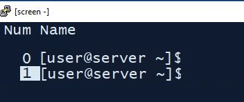

```{r setup, include=FALSE}
knitr::opts_chunk$set(echo = TRUE, eval = FALSE)
```

# Servidores

ISGlobal dispone actualmente de diversos servidores de computación para realizar tareas que no se pueden hacer en los ordenadores de sobremesa. El acceso a estos servidores está gestionado por el SRI. Una vez se tiene acceso, se necesitan dos herramientas para poder trabajar, un cliente SSH y un cliente FTP. El cliente SSH nos permitirá lanzar procesos en el servidor mientras que el cliente FTP nos permitirá gestionar los datos.

# Trabajando en el servidor

Los servidores SSH nos permiten realizar cambios en el servidor. Hay varios servidores SSH disponibles para Windows, como por ejemplo putty o mobaxterm. El documento __Access to the ISGlobal Computing Workstation (WS)__ explica como configurar estos programas para acceder a la WS. Este documento también explica el sistema de archivos o como instalar programas y se encuentra disponible en la intranet (SRI->Information and rules). 

Una vez tenemos configurado nuestro cliente SSH, ya podemos crear una sesión. Una sesión es una conexión entre nuestro ordenador y el servidor.  A través de esta conexión, podemos enviar comandos que se ejecutarán en el servidor. Los comandos son los que nos permiten hacer tareas, como crear carpetas, mover/copiar archivos o correr scripts de R. Los servidores utilizan CentOS como sistema operativo por lo que debemos utilizar comandos de Linux que esten adaptados a CentOS. Al final de este documento hay un listado de algunos comandos útiles en Linux. 

Entendemos por sesión como el tiempo que estamos conectados al ordenador. Una sesión se mantiene activa mientras el cliente SSH esté en funcionamento. Por lo tanto, si apagamos nuestro ordenador, la sesión se cierra. Los programas que estemos ejecutando trabajos dependen de la sesión, por lo que aquellos que se estén corriendo al cerrar la sesión se pararán. Para evitar que los programas que se esten ejecutando se paren, recurrimos al uso del screen.

# Uso de Screen

El comando screen nos permite seguir ejecutando nuestros trabajos en el servidor aunque se cierre la sesión mediante la creación de screen crea un terminal virtual dentro del servidor que es independiente de nuestra sesión. Así, aquello que se ejecuta en un screen se sigue ejecutando trabaja funciona hasta que acaba o hasta que cerremos el screen independientemente de que apagemos o no nuestro ordenador. Otra ventaja es que podemos acceder al screen con diferentes sesiones. De esta manera, podemos acceder a la misma terminal desde diferentes ordenadores o en momentos diferentes. 

Para abrir un screen, debemos ejecutar el siguiente código:

```{bash, eval=FALSE}
#Crear nuevo screen
screen -S prueba
```

Este código genera un screen que se llama __prueba__ y nos mete en él. Un screen está compuesto por diferentes pestañas. Cada pestaña tiene una terminal en la que podemos lanzar diferentes trabajos. Un screen se crea con una sola pestaña. Podemos crear otra con la siguiente secuencia:

```{bash, eval=FALSE}
#Crear nueva pestana
Ctrl + A, Ctrl + C
```
Sabremos que se ha creado un screen porque en la parte superior de la ventana pondrá screen0.


Para que funcione esta combinación debe pulsarse *Ctrl + A* y *Ctrl + C* seguidamente. Esta combinación nos genera una nueva pestaña con el numero 1. Podemos ver las pestañas existentes con:

```{bash, eval=FALSE}
#Listar pestañas
Ctrl + A, Shift + 2
```



Este menú nos muestra las pestañas. Con los cursores podemos seleccionar una pestaña y con intro nos movemos a la pestaña seleccionada. Hay otras opciones para movernos entre las pestañas. Podemos movernos a una pestaña si sabemos su número con:

```{bash}
#Ir a una pestaña específica
Ctrl + A, 0
```

Donde 0 es el número de la pestaña. También podemos desplazarnos a la siguiente pestaña con:

```{bash}
#Ir a la siguiente pestaña
Ctrl + A, N
```

Si queremos cerrar una pestaña, debemos ejecutar el comando:

```{bash}
# Cerrar una pestaña
exit
```

Antes de cerrar nuestra sesión, es recomendable desconectarnos del screen con la combinación:

```{bash}
#Salir del screen sin cerrar:
Ctrl + A, Ctrl + D
```

Esta combinación *NO* cierra el screen, solamente separa nuestra sesión del screen. Para volver a entrar en el screen debemos escribir: 

```{bash}
#Abrir un screen
screen -r nombre/pid
```

Este comando debemos ejecutarlo al iniciar una nueva sesión o si hemos desconectado previamente del screen. Podemos ver la lista de screen que tenemos con:

```{bash}
#Listar screens abiertos:
screen -ls
```

Aquí veremos todos los screens abiertos. Los screens tiene un pid y un nombre. Podemos recuperar el screen usando cualquiera de los dos. Aunque no es recomendable, podemos tener dos screens con el mismo nombre. En este caso tendríamos que acceder con el pid. 

La lista de los screens también nos muestra su estado. Si todo ha ido bien, los screens estarán en detached y podremos acceder con `screen -r`. También puede pasar que el screen se quede fijado en otra sesión, por lo que veríamos que el screen está attached. En este caso, tenemos que ejecutar el siguiente código para acceder al servidor:


```{bash}
#Restaurar un screen perdido (attached)
screen -dr nombre/pid
```

Para cerrar un screen, debemos cerrar todas sus pestañas. Para eso ejecutaremos el comando `exit` en todas las pestañas. 

Finalmente, hay un par de combinaciones que pueden ser útiles:

```{bash}
#Matar una pestaña de un screen si no podemos pq esta ejecutando algo:
Ctrl + A, k
```

Esto nos permite matar una pestaña que no reacciona a nuestros comandos. Esta opción se debe usar cuando no nos quede otro remedio. 


```{bash}
# Subir hacia arriba para ver comandos ejecutados
Ctrl+A y ESC
#para salir:
ESC
```

Esta combinación nos permite movernos por el contenido de la consola al mover las flechas hacia arriba que de otra manera se limita a muy pocas lineas. 

## Recomendaciones de uso 

Como hemos comentado previamente, todo el trabajo de computación debería hacerse dentro de un screen para permitir que siga corriendo una vez cerremos la sesión. Los screen tienen pestañas por las que es muy fácil moverse. Por lo tanto, recomendamos usar un screen para cada proyecto en el que estemos trabajando. 

Otra recomendación es reservar una pestaña de cada screen para una aplicación que controle el estado del sistema. Un ejemplo es `htop` que nos permite ver cuantos procesadores y cuanta memoria RAM se está utilizando en este momento. Tenemos que tener en cuenta esta información a la hora de decidir que trabajos lanzamos y como lo hacemos. `htop` también nos da la opción de matar nuestros procesos, lo que puede ser útil si se bloquea la terminal que los ha lanzado. A continuación se ve un ejemplo de `htop`. 


# Comandos útiles de linux

Los siguientes comandos están extraídos de un [blog](https://openwebinars.net/blog/La-guia-definitiva-para-aprender-a-usar-la-terminal-de-Linux/)

## Navegando por los directorios

pwd: “Print working directory” (Muestra el directorio de trabajo), nos mostrará la ruta en la que nos encontramos actualmente. Muy útil si hemos estado saltando de subcarpeta en subcarpeta y el prompt nos muestra sólo una ruta abreviada.

ls: Nos muestra una lista con el contenido del directorio actual (o el que le pasemos como argumento, por ejemplo: “ls /home/usuario”).

ls –l: Muestra una lista del contenido del directorio añadiendo información adicional de los ficheros o carpetas, como permisos, fecha y hora de creación o modificación, etc…

ls –a: Muestra una lista de todos los ficheros del directorio, incluyendo los ficheros o carpetas ocultos.

cd: nos lleva al directorio raíz.

cd .. : Subiremos un nivel en el árbol de directorios. Si por ejemplo nos encontramos en /home/usuario, con este comando nos iremos a /home. 

## Examinando archivos

file: determina el tipo de un archivo.

cat: muestra el contenido de un archivo o nos permite seleccionarlo para posteriormente hacer algo con él.

less: muestra el contenido de un archivo, y lo va paginando en caso de que sea necesario por ser muy extenso.

## Manipulando archivos y directorios

cp: Copia un fichero o directorio.

cp –i: Copia un fichero o directorio y pregunta antes de sobrescribir si se diese el caso.

cp –r: Copia un directorio con todo su contenido.

mv: Mueve o renombra un fichero o directorio. En la terminal de Linux, en lugar de renombrar un fichero mediante un comando exclusivo, utilizamos el mismo que para mover archivos o directorios, y lo que hacemos para renombrarlo es moverlo a la misma ruta donde se encuentra y cambiarle el nombre.

mv –i: Mueve o renombra un fichero o directorio preguntando antes de sobrescribir si se diese el caso.

mkdir: Crea un directorio.

rmdir: Elimina un directorio vacío.

rm: Elimina un fichero.

  rm –r: Elimina un directorio y todo su contenido.

  rm –i: Elimina un fichero solicitando confirmación. Es muy recomendable usarlo con la opción –r para poder usarlo con directorios evitando problemas. 

## Atajos de teclado

Shift (Mayus) + RePág: Realizaremos scroll hacia arriba en la terminal.

Shift (Mayus) + AvPág: Realizaremos scroll hacia abajo en la terminal.

Tab (Tabulador): Completará el comando, nombre de fichero o directorio que estemos escribiendo. En caso de múltiples coincidencias, con una doble pulsación de esta tecla obtendremos todos los resultados posibles encontrados en el directorio o sistema.

Flecha de dirección ‘arriba’ y /o ‘abajo’: Nos moveremos por el historial compuesto por los últimos comandos usados.

Ctrl + r: Buscará en el historial el último comando usado según lo que vayamos escribiendo. Por ejemplo utilizamos el comando clear hace unas horas, si pulsamos Ctrl + r y escribimos cl nos mostrará el comando clear, puesto que lo ha buscado en el historial y es el más reciente que coincide.

Ctrl + c: Interrumpe cualquier proceso en ejecución de forma inmediata y nos devuelve al prompt.

Ctrl + z: Envía el proceso actual a segundo plano. Para recuperarlo sólo tendremos que escribir fg y pulsar Intro.

Ctrl + w: Elimina la palabra anterior a la posición del cursor.

Ctrl + k: Corta todo aquello que se encuentra entre la situación del cursor y el final de la línea.

Ctrl + u: Corta la línea en la que nos encontramos al completo.

Ctrl + y: Pega el contenido copiado o cortado con Ctrl + u o Ctrl + k.

!!: Repetirá el último comando usado. 


## Comandos de proceso

ps: Muestra los procesos que se encuentran activos en el sistema actualmente.

top: Muestra todos los procesos en funcionamiento.

kill “pid” (process id): Detiene el proceso asignado al pid que muestra la salida del comando ps.

bg: Muestra todos los procesos pausados o en segundo plano (recordamos que Ctrl + z establecía procesos en segundo plano).

fg: Trae de vuelta el proceso más reciente puesto en segundo plano. 

## Comandos de comandos:

man xxxxx: Muestra el manual de uso o configuración del programa xxxxx.

man –k xxxxx: Muestra las páginas de manual que contengan la palabra xxxxx.

apropos xxxxx: Lista las páginas de manual que tratan acerca del comando xxxxx.

whereis xxxxx: Muestra la localización más probable para el programa xxxxxx. 

## Otros comandos

R: inicia la versión de R del sistema

Rscript script.R: ejecuta el código de script.R

# Otras operaciones

## Añadir al PATH

Se trata de editar el fichero:

```{bash, eval=FALSE}
nano ~/.bash_profile
```
Justo en la la linea anterior de export PATH añadir lo siguiente:
```{bash, eval= FALSE}
export PATH=$PATH:"/path/to/folder/" #no hace falta poner las comillas
```

guardar y salir.

Para que se cargue en la misma sesión hacer:
```{bash, eval=FALSE}
source ~/.bash_profile
```

## For
```{bash, eval=FALSE}
for i in $(cat list) #opcion 1
for i in {1..22} #opcion 2
do
	command1 on $OUTPUT
	command2 on $OUTPUT
	commandN
done

for i in $(cat list)
do
  mkdir $i #creara una carpeta con el nombre de la primera linea del fichero list
  mv $i.mrm.sig_results.txt ./$i # te mueve el nombre el fichero a la localizacion $i.
   
done
```

## Contador 

```{bash}
aa=( $(wc <list))
bb=1
for i in $(cat list)
do
  echo "Analyzing" $bb "/" $aa; bb=$((bb+1))
  /path/to/your/$i/script/script
done
```


## mover todos los ficheros a partir de una lista a una carpeta con su nombre. Cuando tienen "_" en el nombre

lista tiene EPR001
ficheros EPR001_plot.pdf mover a carpeta EPR001

```{bash, eval=FALSE}
for i in $(cat lista)
do
  mv ./plots/$i* ./$i
done
```


## FIND y borrar

```{bash}
https://alvinalexander.com/unix/edu/examples/find.shtml
#para que te diga desde esta posicion y subdirectorios cuantos ficheros con ese nombre encuentra.

find ./ -name variants.vcf.gz -type f|wc -l

find . -name "final*" -type f -delete
#para ver lo que se va a borrar antes quitar la opcion de delete

```

##obtener numero de columnas de un fichero en bash
```{bash}
awk '{print NF}' file | sort -nu | tail -n 1
```

## seleccionar todas las filas menos la primera:

```{bash, eval=FALSE}
tail -n +2 FILE 
```

## Transponer un fichero en bash.

https://stackoverflow.com/questions/1729824/an-efficient-way-to-transpose-a-file-in-bash
```{bash, eval=FALSE}
awk '
{ 
    for (i=1; i<=NF; i++)  {
        a[NR,i] = $i
    }
}
NF>p { p = NF }
END {    
    for(j=1; j<=p; j++) {
        str=a[1,j]
        for(i=2; i<=NR; i++){
            str=str" "a[i,j];
        }
        print str
    }
}' yourfile
```

## mirar datos especificos de un gzip

```{bash, eval=FALSE}
gzip -cd chr1.dose.vcf.gz |head -n 12 |tail -n 1>todas_muestras.txt
```

## cambiar nombre de ficheros bash

https://unix.stackexchange.com/questions/121570/rename-multiples-files-using-bash-scripting

actua como un sed
```{bash, eval=FALSE}
for f in *_RESULTS_*
do
  mv $f ${f/_RESULTS_/_Analysis_1_}
done

for i in {1..24}
do
mv chr$i.dose.vcf.gz.bgen chr$i.dose.bgen
done
```
## Eliminar lineas de un texto que tienen la palabra "SOURCE":

```{bash, eval=FALSE}
grep -v 'SOURCE' file.txt >file2.txt
```

## comandos de sed

Para trabajar sobre el mismo fichero de input y output.

```{bash, eval=FALSE}
sed -i 's/2006/2007/g' file
```
para cambiar el cambio de linea con un espacio:

```{bash, eval=FALSE}
sed -i ':a;N;$!ba;s/\n/ /g' file
```


#ANEXO


